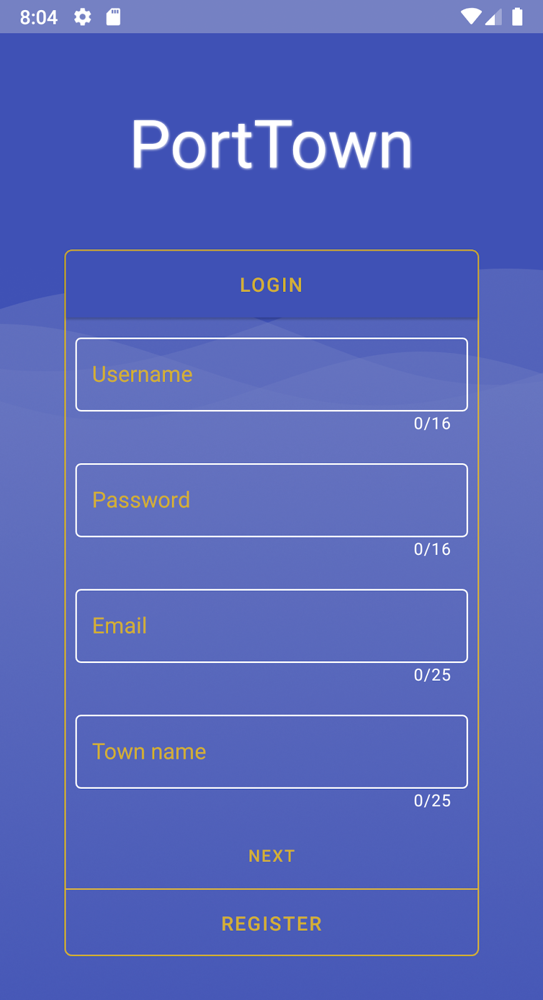
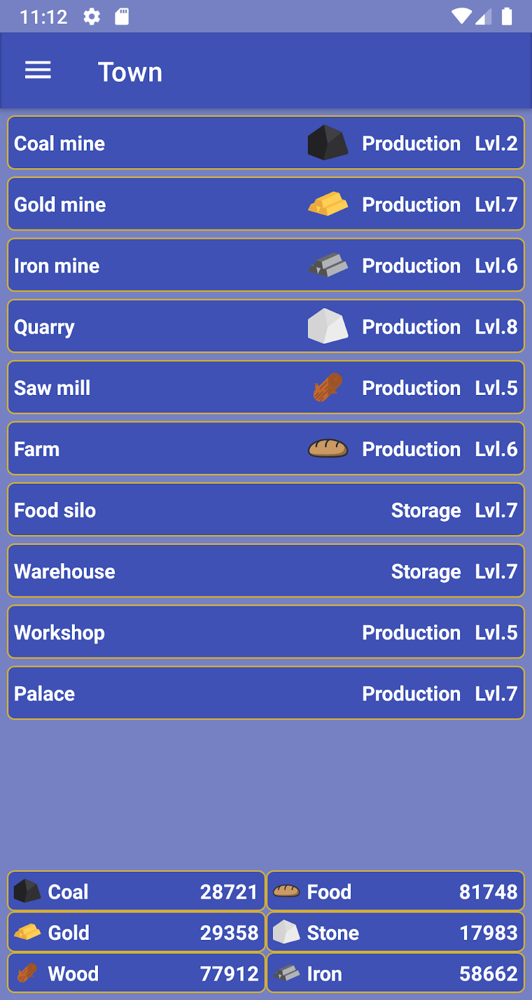
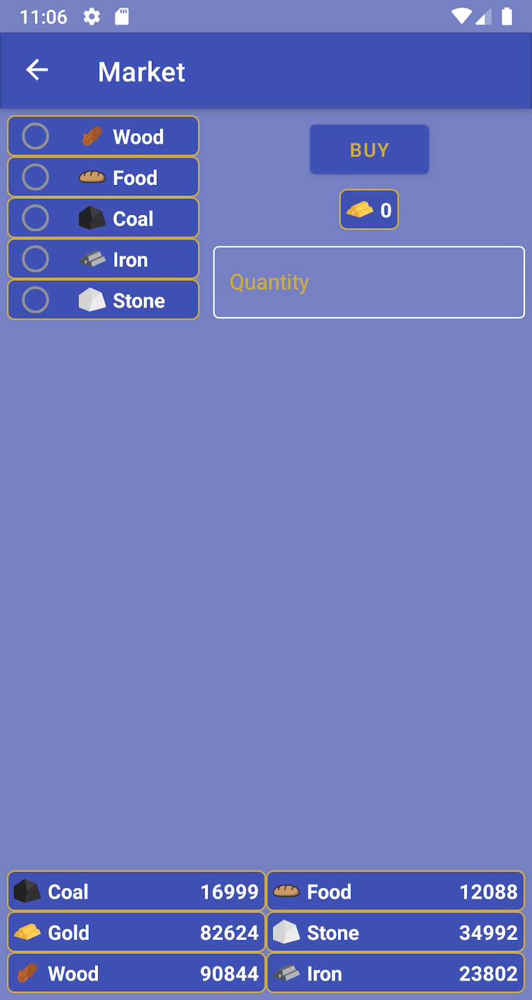
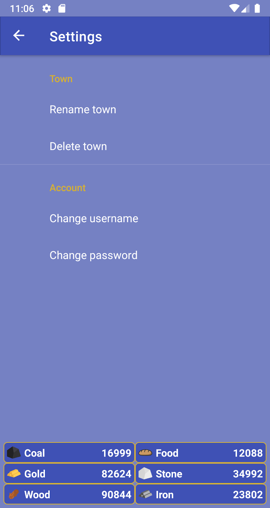
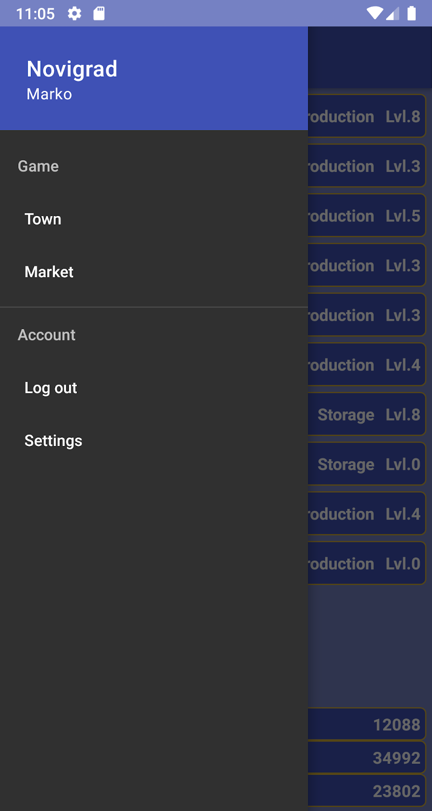

## Group university project, an idle game
- Android app using MVVM architecture
- Played a bit with Flow and Koin for the first time\
Group project consisted of a web, a desktop and an android app, I did the android part so I don't have the backend code but on the backend only the authentication API was finished. I made some parts use, what i presumed, final API might look like but it was never finished so there are some hardcoded or randomized values as placeholders used just for showcase.
### Some screenshots:

